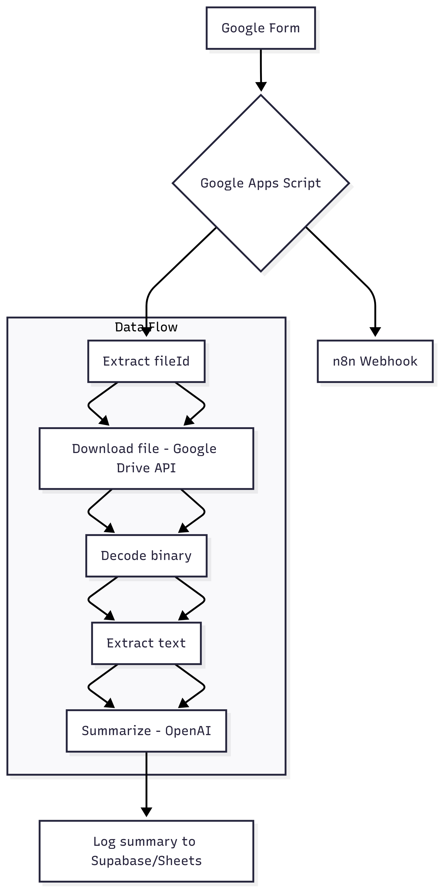
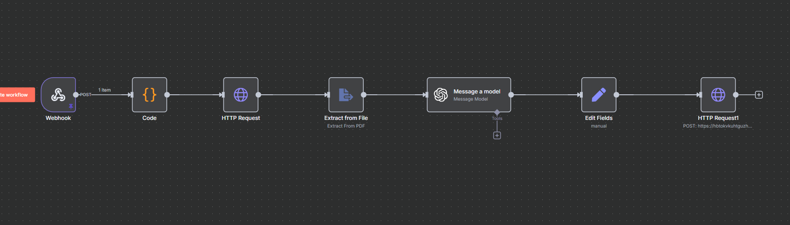

# AI Document Summarizer with n8n, Google Forms, and OpenAI

Automatically extract, summarize, and store insights from PDF files submitted via Google Forms using n8n workflow automation.

## 🧪 Overview
This automation pipeline allows users to submit documents (PDF, TXT, DOC) via a Google Form. These documents are processed and summarized by OpenAI, orchestrated using n8n. The results are stored in Supabase or Google Sheets.

## ⚙️ Tech Stack
- **Google Forms**: File upload and form submission
- **Google Sheets + Apps Script**: Metadata logging and webhook trigger
- **n8n Cloud**: Core automation engine and workflow orchestration
- **Google Drive API**: Secure file download and binary handling
- **OpenAI API**: Document summarization with GPT models
- **Supabase**: Database storage and logging

## 📆 Features
- ✅ Extracts `fileId` from Google Drive URLs automatically
- ✅ Downloads binary content from Google Drive API
- ✅ Handles PDF file formats
- ✅ Decodes and extracts raw text from binary data
- ✅ Sends text to OpenAI API for intelligent summarization
- ✅ Stores results in Supabase with full metadata
- ✅ Designed for complete automation via Google Forms
- ✅ Error handling and binary data validation
- ✅ Production-ready webhook system


## 🚀 Workflow Diagram





## 💡 Setup Instructions

### 1. Clone the Repository
```bash
git clone https://github.com/YOUR_USERNAME/n8n-pdf-summarizer.git
```
```bash
cd n8n-pdf-summarizer
```
### 2. Setup Google Form
Create a new Google Form with the following fields:
* **Name** (Short answer)
* **Email** (Short answer, validate as email)
* **Document Type** (Dropdown or multiple choice, e.g., "Report", "Invoice", "Other")
* **File Upload** (File upload field, restrict to PDF, set maximum size to 10MB)
  
**Important:** Link your Google Form responses to a new Google Sheet. This sheet will be used by the Google Apps Script.


### 3. Install Google Apps Script
1.  Open the Google Sheet linked to your form.
2.  Go to `Extensions` > `Apps Script`.
3.  Copy the content from your `apps-script/form-submit.gs` file and paste it into the Apps Script editor. Save the project.
4.  Deploy a trigger for the script:
    * In the Apps Script editor, click the **Triggers** icon (looks like an alarm clock).
    * Click `Add Trigger` in the bottom right.
    * Configure the trigger:
        * **Choose function to run:** `onFormSubmit`
        * **Choose deployment where function is:** `Head`
        * **Select event source:** `From spreadsheet`
        * **Select event type:** `On form submit`
    * Click `Save`. You may need to authorize the script to access your Google services.

### 4. Setup n8n Workflow
1.  Import the workflow from `workflows/pdf-summarizer-workflow.json` into your n8n Cloud instance.
2.  Configure the following nodes within the imported workflow:

    * **Webhook Node:**
        * Method: `POST`
        * Path: `pdf-parser-v2` (or your desired unique path)
        * Response Mode: `Respond with last node`

    * **Function Node 1: Extract fileId from Drive URL**
        * This node should contain logic to parse the Google Drive URL from the incoming webhook data and extract the `fileId`.

    * **HTTP Request Node:**
        * Method: `GET`
        * URL: `https://www.googleapis.com/drive/v3/files/{{ $json["fileId"] }}?alt=media`
        * Authentication: Configure **Google Drive OAuth2** credentials.
        * Response Format: `File`
        * Put Output In Field: `data` (This will store the binary file content)

    * **Use n8n's Extract from File Node**
        * Operation: `Extract Text`
        * Binary Property: `data`

    * **OpenAI Node: Summarize**
        * Configure this node to use your OpenAI API credentials.
        * Set the prompt to summarize the text output from the previous node.
        * **Prompt:**
        * * `Please provide a comprehensive summary of the following document:
            {{ $json.text }}
            Focus on key points, main arguments, and actionable insights.`

    * **Supabase Node: Insert into table**
        * Configure this node with your Supabase credentials (Project URL, API Key).
        * Specify the table and columns where the summarized text should be inserted.
